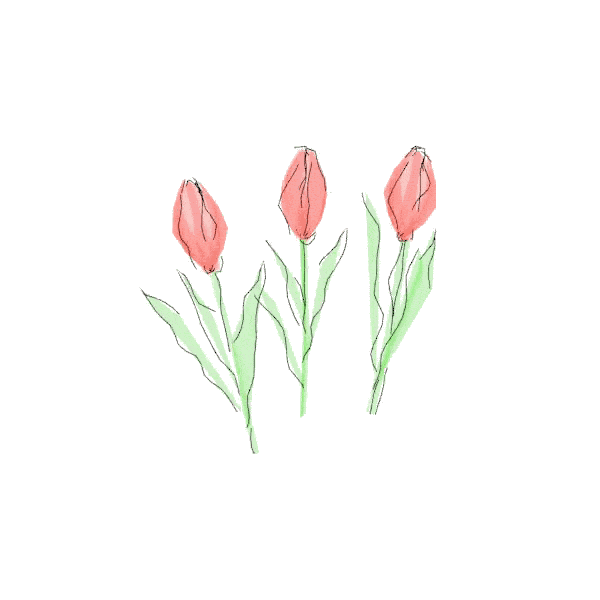

<b>Oii! Sou Mikelly, mas conhecida como Mi ✨</b>

 

  

<blockquote>

<b> Clique aqui para descobrir mais sobre mim! </b>

 

  Sou estudante de <b>Engenharia da Computação na UFBA</b> e apaixonada por tecnologia. Sempre tive curiosidade em entender como <b>hardware e software</b> funcionam juntos, o que despertou meu interesse por diferentes áreas da computação.
    
  Hoje, busco construir minha carreira em <b>Ciência de Dados e Machine Learning</b>, desenvolvendo soluções que geram impacto por meio dos dados.
    
  Ao longo da minha trajetória, atuei como <b>Diretora de Gestão de Pessoas na INFO JR</b>, experiência que fortalece minhas habilidades de liderança, comunicação e trabalho em equipe.
    
  Estou sempre em busca de novos desafios e aprendizados.

 

 
 
<!-- ================= MINHAS FERRAMENTAS ================= -->
### 🪛 Minhas Ferramentas

As linguagens e tecnologias que uso para dar vida às minhas ideias:

<!-- Engenharia e Dados -->

  
<!-- Web e Controle -->

 
 

<!-- ================= CONTATO ================= -->
### 📱 Seção Contato

  Estou sempre aberta para conversar sobre projetos, tecnologia ou apenas para trocar ideias! Entre em contato comigo através dos seguintes meios:

   
  
  &nbsp;
  
  &nbsp;
    

 
 

<!-- ================= MINHAS ESTATÍSTICAS ================= -->
### 🎮 Minhas Estatísticas

Acompanhando minha evolução diária nos estudos e projetos:

| | |
|:---:|:---:|
|  |  |
|  |  |

</blockquote>

 

  

 
